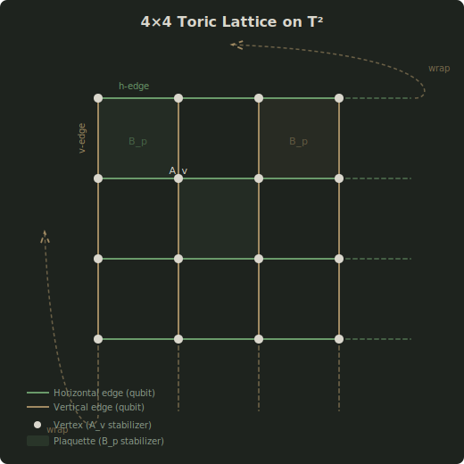
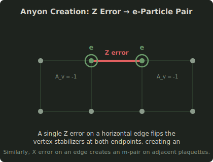
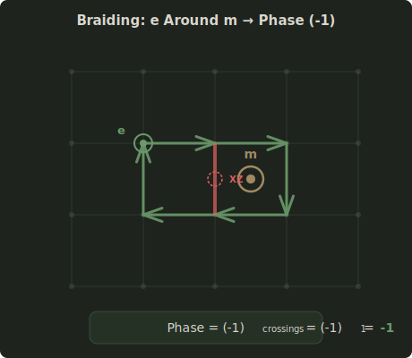
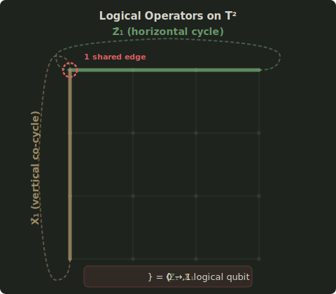
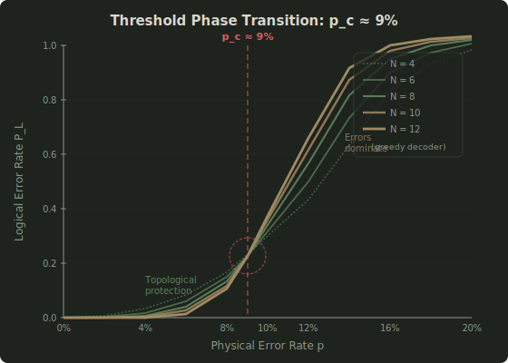

# toric-code-sim

**Kitaev toric code simulator — Pauli frame tracking of anyonic excitations and braiding on T²**

Sylvain Cormier | [Paraxiom Research](https://paraxiom.org) | February 2026

---

## Physics

The **toric code** (Kitaev, 2003) is the canonical example of topological quantum error correction. Qubits live on the edges of an N×N square lattice with periodic boundary conditions — a torus T². The topology of T² provides exponential protection against local errors, making it the leading architecture for fault-tolerant quantum computing.

### Stabilizers

Every vertex v and every plaquette p define a stabilizer operator:

| Stabilizer | Formula | Measures |
|-----------|---------|----------|
| **A_v** (vertex) | ∏ X on 4 edges touching v | Z-error parity → **e-particles** |
| **B_p** (plaquette) | ∏ Z on 4 edges bounding p | X-error parity → **m-particles** |

All stabilizers commute: [A_v, B_p] = 0. The code space is the +1 eigenspace of all stabilizers.

### Anyons

Stabilizer violations create **anyonic excitations** — quasiparticles that always appear in pairs:

- **e-particles** (electric charges): vertex stabilizer violations from Z errors
- **m-particles** (magnetic fluxes): plaquette stabilizer violations from X errors

Fusion rules follow Z₂ × Z₂ symmetry:

| Fusion | Result |
|--------|--------|
| e × e | Vacuum |
| m × m | Vacuum |
| e × m | Fermion (ε) |

### Braiding

Braiding an e-particle around an m-particle accumulates a topological phase:

**Phase = (-1)^crossings**

where crossings count edges carrying both X and Z errors (from XZ = -ZX anticommutation on individual qubits). This mutual statistics θ_em = π is the hallmark of Z₂ topological order.

### Non-Contractible Cycles (Logical Operators)

The torus T² has non-trivial first homology H₁(T², Z₂) = Z₂², giving rise to **2 logical qubits** protected by non-contractible cycles:

- **Z̄₁**: Z on all horizontal edges in a row (horizontal cycle)
- **X̄₁**: X on all vertical edges in a column (vertical co-cycle)

These anticommute ({Z̄₁, X̄₁} = 0) because they share exactly one edge on T². The code distance is d = N — a logical error requires N errors forming a non-contractible chain.

---

## Diagrams

### Toric Lattice

<p align="center">
  
</p>

### Anyon Creation

<p align="center">
  
</p>

### Braiding

<p align="center">
  
</p>

### Logical Operators

<p align="center">
  
</p>

### Threshold Crossing

<p align="center">
  
</p>

---

## Architecture

```
toric-code-sim/
├── src/
│   ├── lib.rs          — Module re-exports and prelude
│   ├── lattice.rs      — ToricLattice: N×N torus, edge indexing, Pauli frame (4N² bits)
│   ├── syndrome.rs     — Syndrome measurement: vertex/plaquette parity, logical error detection
│   ├── anyon.rs        — Anyonic excitations: e/m creation, movement, fusion
│   ├── braiding.rs     — Braiding phases, linking numbers, logical operators
│   └── simulation.rs   — Monte Carlo: random errors, greedy decoder, threshold sweep
├── examples/
│   ├── anyon_braiding.rs     — Interactive demo: creation, braiding, fusion
│   └── scaling_analysis.rs   — Threshold extraction, exponential suppression, code distance
├── diagrams/           — SVG diagrams (this README)
└── presentation/       — LCARS web presentation
```

### Pauli Frame Representation

The simulator uses classical bit-vector tracking (not exponential state vectors):

- **X-frame**: `Vec<bool>` of 2N² bits — tracks X errors on each edge
- **Z-frame**: `Vec<bool>` of 2N² bits — tracks Z errors on each edge
- **Total memory**: 4N² bits → N=50 requires only 10,000 bits

This enables lattice sizes of N=50+ while faithfully tracking all stabilizer syndromes and braiding phases.

---

## Quick Start

```bash
# Run all 39 tests
cargo test

# Anyon braiding demo (creation, fusion, braiding phases)
cargo run --example anyon_braiding

# Scaling analysis (threshold, exponential suppression, code distance)
cargo run --example scaling_analysis
```

---

## Key Results

| Property | Value | Verified By |
|----------|-------|-------------|
| **Threshold** (greedy decoder) | p_c ≈ 9% | `scaling_analysis` — curve crossing for N=4..12 |
| **Exponential suppression** | P_L ~ exp(-αN) below p_c | Least-squares fit on (N, -ln P_L) |
| **Code distance** | d = N | Non-contractible chain length |
| **Braiding phase** (e around m) | -1 | Pauli frame XZ overlap count |
| **Trivial braid** (no m enclosed) | +1 | Zero crossings |
| **Logical qubits** | 2 (from H₁(T², Z₂)) | Anticommutation {Z̄₁, X̄₁} = 0 |
| **Mutual statistics** | θ_em = π (fermionic) | Phase = (-1)^1 |
| **Topological degeneracy** | 4-fold (2² from 2 logical qubits) | H₁(T², Z₂) = Z₂ × Z₂ |

---

## The T² Unification

The same torus that protects quantum information appears across three domains:

| Domain | Torus Role | Crate |
|--------|-----------|-------|
| **Quantum Error Correction** | T² lattice → topological code distance | `toric-code-sim` (this crate) |
| **Consensus** | Tonnetz T² → Proof of Coherence | `topological-coherence` |
| **Machine Learning** | Toroidal logit bias → +40% drift reduction | DOI: 10.5281/zenodo.18516477 |

The torus is not a metaphor — it is the geometric structure that provides protection through non-contractible cycles, spectral gaps, and topological invariants.

---

## References

- Kitaev, A.Y. (2003). "Fault-tolerant quantum computation by anyons." *Annals of Physics*, 303(1), 2-30. DOI: [10.1016/S0003-4916(02)00018-0](https://doi.org/10.1016/S0003-4916(02)00018-0)
- Dennis, E. et al. (2002). "Topological quantum memory." *J. Math. Phys.*, 43(9), 4452-4505. DOI: [10.1063/1.1499754](https://doi.org/10.1063/1.1499754)
- Cormier, S. (2026). "Toroidal Logit Bias." Zenodo. DOI: [10.5281/zenodo.18516477](https://doi.org/10.5281/zenodo.18516477)
- Cormier, S. (2025). "Topological Coherence." Zenodo. DOI: [10.5281/zenodo.14538933](https://doi.org/10.5281/zenodo.14538933)

---

## License

Apache 2.0 — Paraxiom Technologies Inc.
